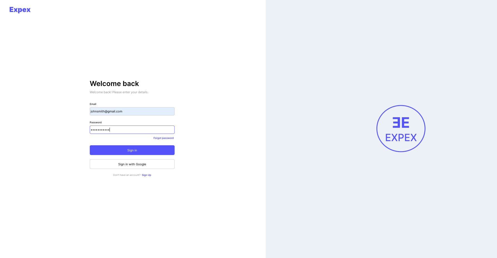
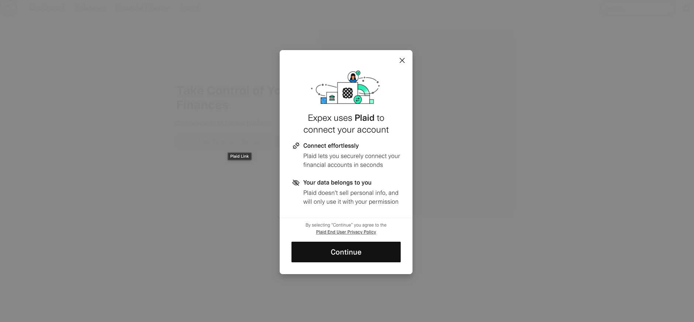
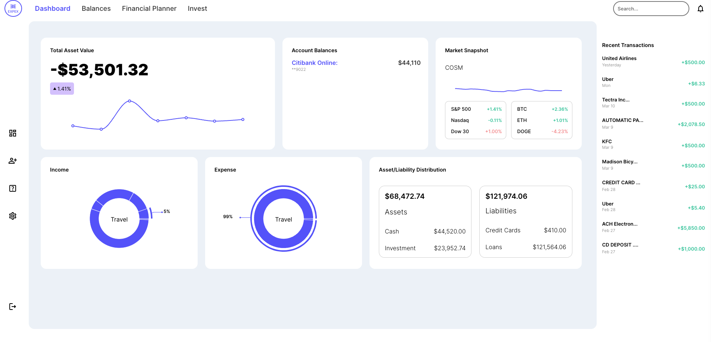
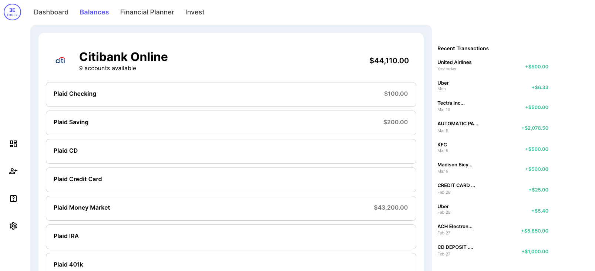

Live Website: https://expex-b6bc6.firebaseapp.com/

# Expex

Pitch Deck: https://docs.google.com/presentation/d/1-NzeOY5hDtoE-cIWA-F5iEvQ3BO0mcTn3gaoYtMBfK4/edit?usp=sharing

Expex is an application that allows users to seamlessslty monitor all their bank account, investment portfolios and digital assets from one secure location. 

## Features

- Easy-to-understand graphics for a holistic overview of finances
- Advanced budgeting features
- Investment guidance
- Virtual financial advisor powered by a deep learning model
- Recommendation of financial products like credit cards and loans to maximize savings and earnings
- Recommendation of ways to decrease spending on recurrent payments

## Why Expex?

In the United States, a majority of individuals, approximately 64%, live paycheck to paycheck. Unfortunately, many young adults lack the necessary financial literacy skills, as this topic is not a prominent part of the educational system, leaving them to learn important lessons through trial and error. Expex empowers the next generation of young adults to develop important and sustainable financial habits.

## Getting Started

### Sign Up for an Account and Log In 
(for ease you can use username: johnsmith@gmail.com password: password123)

### Add your Bank Accounts through Plaid (Don't worry this is safe)

### Quickly Glance at all of your balances in one place

### Dig further into your Individual Accounts

### See how you can save money in minutes
Comming soon...

## Technologies used

- React.js
- Node.js
- Express.js
- Firebase
- Redux Toolkit
- Plaid API
- Open AI API

## Contributors

- Labesh Baral
- Shubham Yadav

## Run for yourself
The app is still under production
Please wait for updates for the future!

## License

This project is licensed under the MIT License - see the [LICENSE](LICENSE) file for details.
